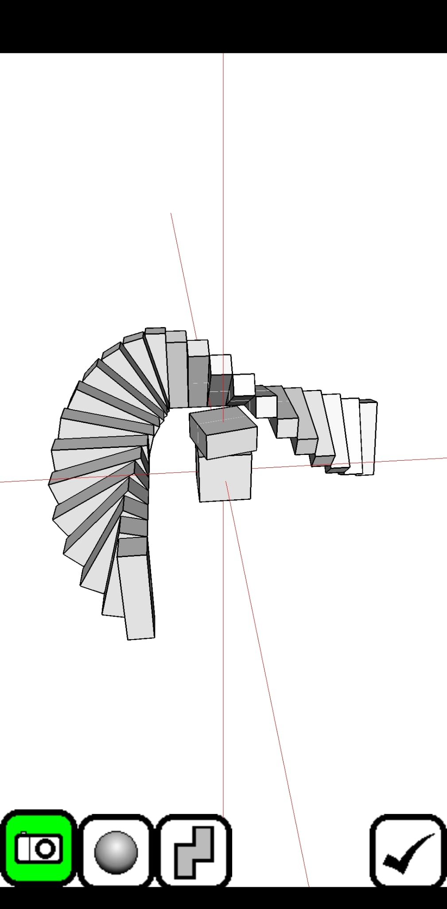
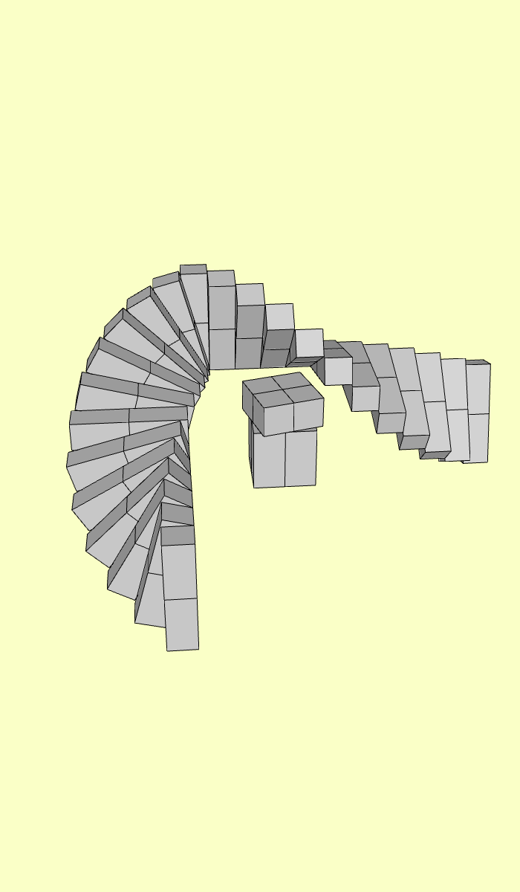

# Qubism to OBJ

Convert Qubism Android JSON models into Wavefront OBJ files that can be opened in Blender or any OBJ-compatible 3D viewer.

## Preview

| Qubism Android model | Converted OBJ model |
|:--------------------:|:-------------------:|
|  |  |

## Usage

Install dependencies once:

```bash
npm install
```

Put your exported Qubism `.json` files in:

```text
src/input/
```

Run the converter:

```bash
npm start
```

Generated `.obj` files are written to:

```text
src/output/
```

The converter scans every `.json` file in `src/input/` and creates a matching `.obj` file in `src/output/`.

Example:

```text
src/input/my-model.json -> src/output/my-model.obj
```

If the matching `.obj` already exists, the script leaves it untouched. Delete the existing output file first if you want to regenerate it.

## Workflow

1. Create your model in the Qubism Android app.
2. Export the model as a Qubism JSON file.
3. Copy the JSON file into `src/input/`.
4. Run `npm start`.
5. Import the generated OBJ from `src/output/` into Blender or another OBJ-compatible viewer.

## License

This project is licensed under the GNU General Public License v3.0 or later.

That means it is open source copyleft software: if you distribute modified versions of this project, those versions must also remain open source under the same license terms.
